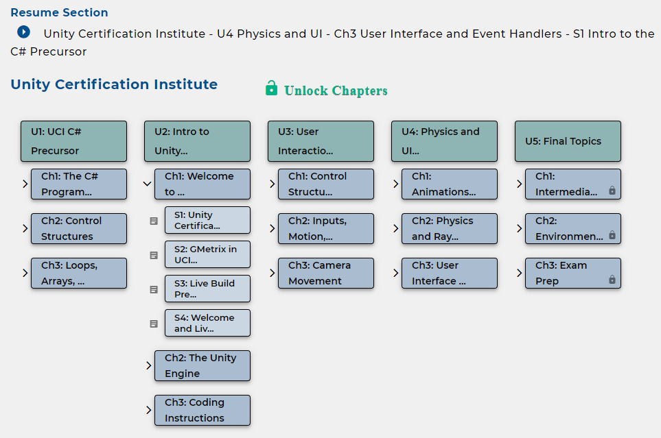

# Map

The course map is a quick way to hop around an entire course.

## Layout

A course is divided in Units, Chapters, and Sections.

**Units** are the pillars of the course. These group together skills from a broad topic in the discipline the course aims to teach.

**Chapters** group together multimedia materials including videos, documents, quizzes, exercises, and projects that come together to teach a core skill. These can be unlocked as the course progresses to keep the class on track.

**Sections** are the individual units of media. A section can be a document, video, or quiz visualized by the icon next to it.

