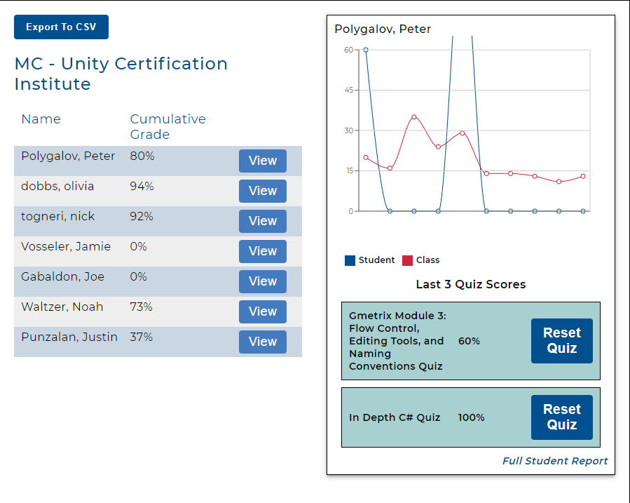
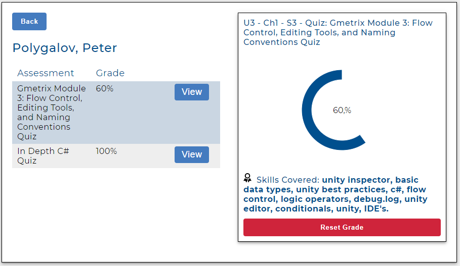
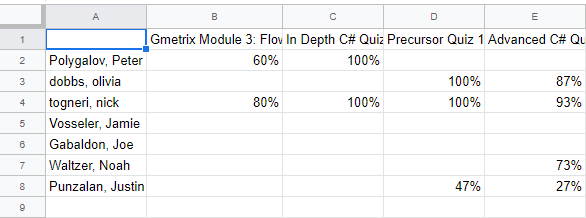

# Grades

You can view the auto-graded quiz scores of your students on the "grades" page.

The table on the left is an overview of your class roster and their cumulative quiz scores.

By clicking "View" on a student row, you can see how their scores compare to the class average over time. You can also view and reset their last 3 quiz scores if you allow students to retake quizzes.

## Full Student Report

To get a full list of a students scores, you can click on "Full Student Report".

In the full student report, you can see every quiz score a student has earned as well as the skills assessed in each quiz.

## Exporting

On the grades page, you can click on "Export To CSV" to download a csv file with all the student scores in the classroom.

