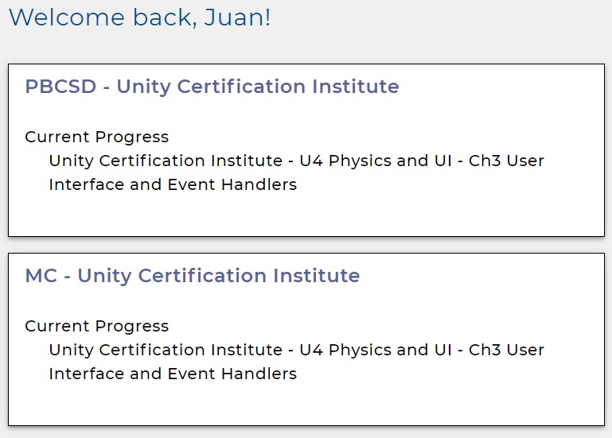
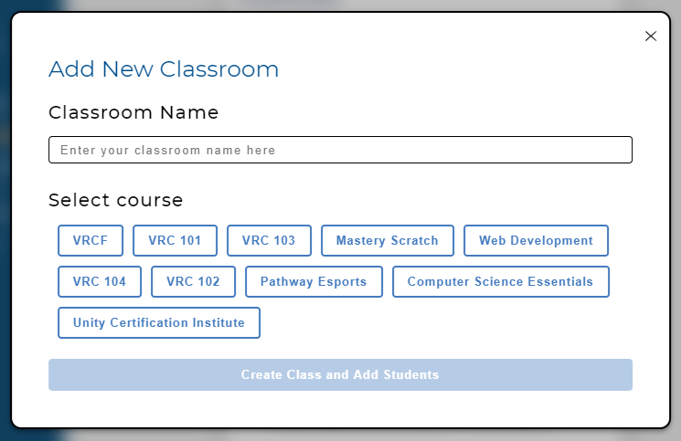
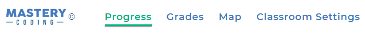
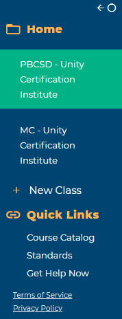

# Home Page

This is the home page of the teacher dashboard. From this page, you can access your classes.

## Classrooms

This is a list of the active classroom's you've created as a teacher. Pick one to access the Progress, Grades, Map, and Classroom Settings views. A classroom is required to add students and control studennt access to the course.

To create a new classroom, use the "+ New Class" button. Simply name your classroom and pick a course.

## Navbar

Once you've selected a classroom, the top navbar can be used to access different views of a classroom.

### Progress

An in-depth look into the current Unit that students are on in the course and quickly allows access to the most recent section.

### Grades

A collection of all the quiz scores students have earned in the course.

### Map

A map of the active classroom's course in its entirety.

### Classroom Settings

Create, modify, export, and reset passwords for your students in your classroom.

## Sidebar

The sidebar can be used to pick an active classroom or create a new classroom.

### Quick Links

At the bottom of the sidebar are links to navigate to other resources.

#### Course Catalog

View all the courses available in your school their entirety. Simply click on a course and navigate to the map where you can pick a section.

#### Standards

Links to our standards alignments for our courses by state. The list is constantly growing!

#### Get Help Now

Links to our community teacher forum. Drop by and...

- Share your experience in the course
- Interact with other teachers
- Get help and troubleshooting from our team with a 24hr response time
